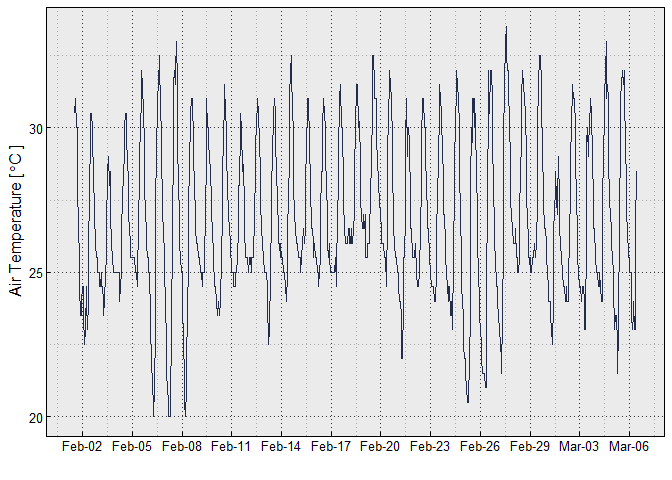
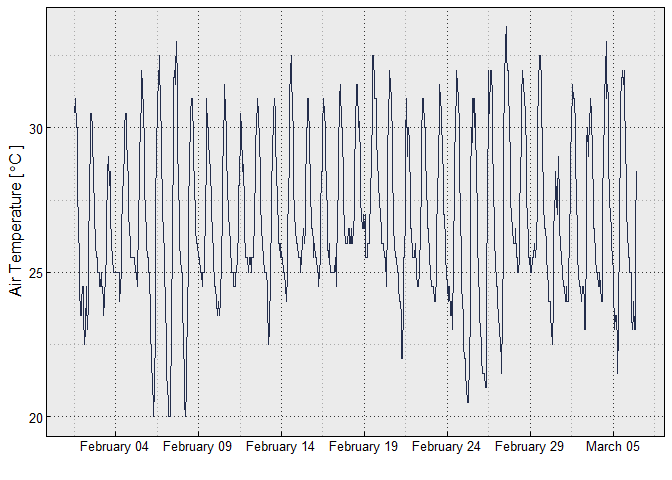
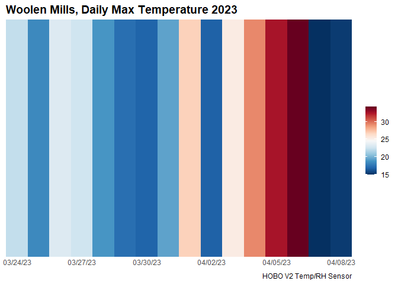
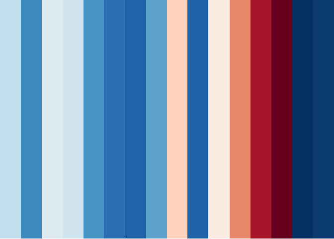

<!-- README.md is generated from README.Rmd. Please edit that file -->

# MicroData

<!-- badges: start -->
<!-- badges: end -->

The goal of the MicroData project is to create streamlined import,
cleaning, munging, and graphing functions to work with a slew of common
environmental sensors from multiple sources.

## How to use the MicroData source

Use of the MicroData source code differs slightly from a standard R
package. It is currently built to run as a `source file` where the user
needs to copy the `source.R` file from the repo `R` directory. Then to
access the code and functions, within an R script, the user must create
this header:

``` r
# Source file for all MicroData functions
source("./R/source.R")

# Package dependencies (may need to install)
library(data.table)
library(lubridate)
library(viridis)
library(ggplot2)
library(gridExtra)
library(cowplot)
library(scales)
library(readxl)
library(dplyr)
library(RColorBrewer)
```

## Importing Data

MicroData has support currently for sensors from OnSet (HOBO),
METER/Decagon, TomST, and iButton, with more to be added. In the `R`
folder for this repo the `MicroDataSandbox.R` file includes full code
for importing and plotting several different sensors, so do look there
for a full list. Importantly, data must be exported from the HOBOWARE
software platform as a `.csv` file.

Data from HOBO sensors can be imported into R using the `read.hobo()`
function. The function has a `sensor = ...` parameter, so make sure you
designate which type/model of HOBO sensor you are using. Current support
exists for the the V2 (`sensor = "v2"`), tidbit (`sensor = "tidbit"`)
and pendant (`sensor = "pendant"`) series of loggers.

First, we can look at data from an OnSet HOBO V2 air temperature and
relative humidity sensor:

``` r
# define the file location
f = "./inst/extdata/hobo_pro_v2.csv"

# import to a data frame
df <- read.hobo(f, sensor = "v2")

# look at the first few lines
head(df)
#>              DateTime   Temp     RH
#> 1 2023-03-24 11:49:35 22.069 51.184
#> 2 2023-03-24 11:49:41     NA     NA
#> 3 2023-03-24 11:50:35 22.112 49.963
#> 4 2023-03-24 11:51:35 21.898 58.559
#> 5 2023-03-24 11:52:35 21.340 57.802
#> 6 2023-03-24 11:53:35 20.954 58.095
```

Note that the `read.hobo()` function formats the data and time into one
`DateTime` formatted as `POSIXct` and yyyy-mm-dd hh:mm:ss. This
formatting for dates and time is standard across MicroData functions.

Additional HOBO sensors can be imported thus:

``` r
# HOBO pendant sensors
df <- read.hobo(f, sensor = "pendant")
# HOBO tidbit sensors
df <- read.hobo(f, sensor = "tidbit")
#> Warning: All formats failed to parse. No formats found.
```

Other data import examples follow similar functions (e.g., `read.meter`,
`read.ibutton`). Examples included in visualization code below.

## Data visualization

### Time Series

First, some common parameters for graphing:

``` r
########### Graphing Parameters
# Custom labels for all plots, long format
TempLabel = expression(paste("Air Temperature [ ", degree,"C ]"))
RHLabel = "Relative Humidity [%]"
LightLabel = expression(paste(Light~Intensity~"["~Lumens~ft^2~"]"))

# Custom labels for plots, science formatted
TempLabelSci = expression(paste("T"[Air]~" (", degree,"C)"))
RHLabelSci = "RH (%)"
LightLabelSci = expression(paste(I~"("~Lumens~ft^2~")"))
VWCLabelSci = expression(paste(theta~"("~m^-3~m^-3~")"))

# create a custom palette
# VCU colors with white removed
VCUColors <- c("#F8B300", "#000000",  "#333333", "#444444", "#555555")
DigitalNeutral <- c("#E57200", "#FFCE00",  "#00B3BE", "#856822", "#275E37", "#B2E0D6", "#E5CBB1", "#CCDBAE")
```

Next, time series data plotted form iButton data:

``` r
# define tile
f = "./inst/extdata/ibutton_ex_BH.csv"

# read in data
df <- read.ibutton(f)

# LONG TIME SERIES
# Link for more information on axis modification for dates, times, and date times:
# https://bookdown.org/Maxine/ggplot2-maps/posts/2019-11-27-using-scales-package-to-modify-ggplot2-scale/

# here is a temperature graph where there are differences in how the dates are handled on the x axis
# here abbreviated month and day e.g. Mar-21
ggplot(df, aes(x = DateTime, y = Temp))+
    geom_line(color = "#232D4B")+
    xlab("")+
    ylab(TempLabel)+
    try_theme()+
    scale_x_datetime(date_labels = "%b-%d", breaks = breaks_width("3 days"))
```

<!-- -->

``` r

# here full month e.g., March 21
ggplot(df, aes(x = DateTime, y = Temp))+
    geom_line(color = "#232D4B")+
    xlab("")+
    ylab(TempLabel)+
    try_theme()+
    scale_x_datetime(date_labels = "%B %d", breaks = breaks_width("5 days"))
```

<!-- -->

Additional plotting options are included in the `MicroDataSandbox.R`
file.

### Climate Stripes

To create climate stripes from data an additional file,
`ClimateStripes.R` is in the `R` folder within the repo. Modifying this
file will allow the user to create custom climate stripe data
visualizations. You can also copy the code from the following worked
example. First we establish the graphing parameters via a custom
`ggplot2` theme and establish a color palette from `RColorBrewer`:

``` r
# Climate Stripe Code

# Graphing Theme Parameters
theme_strip <- theme_minimal()+
    theme(axis.text.y = element_blank(),
          axis.line.y = element_blank(),
          axis.title = element_blank(),
          panel.grid.major = element_blank(),
          legend.title = element_blank(),
          axis.text.x = element_text(vjust = 3),
          panel.grid.minor = element_blank(),
          plot.title = element_text(size = 14, face = "bold")
    )

# Code from RColorBrewer to go Red to Blue
col_strip <- brewer.pal(11, "RdBu")
```

Then we need to import and format our data. We will be using air
temperature data take from the Woolen Mills neighborhood in
Charlottesville collected using a HOBO V2 air temperature and relative
humidity sensor (OnSet Corporation):

``` r
# Source file for all MicroData functions
source("./R/source.R")

# define file
f = "./inst/extdata/hobo_pro_v2.csv"

# import file using the read.hobo function
df <- read.hobo(f, sensor = "v2")

# then we need to reformat the data for the daily maximum (you of course can change that to mean, min, etc.)
df %>%
    select(c(DateTime, Temp)) %>%
    mutate(Date = as.Date(DateTime, na.rm = TRUE)) %>%
    group_by(Date) %>%
    dplyr::filter(Temp == max(Temp, na.rm = TRUE)) %>%
    distinct(Temp, .keep_all = T) %>%
    ungroup() %>%
    data.frame() -> df.day
```

From here we can create the plotting code in `ggplot2` syntax,
incorporating or defined theme above:

``` r
ggplot(df.day, aes(x = Date, y = 1, fill = Temp))+
    geom_tile()+
    scale_x_date(date_breaks = "3 days",
                 date_labels = "%D",
                 expand = c(0, 0))+
    scale_y_continuous(expand = c(0, 0))+
    scale_fill_gradientn(colors = rev(col_strip))+
    guides(fill = guide_colorbar(barwidth = 1))+
    labs(title = "Woolen Mills, Daily Max Temperature 2023",
         caption = "HOBO V2 Temp/RH Sensor")+
    theme_strip
```

<!-- -->

By changing the plotting syntax slightly, we can also create a more
minimalist plot:

``` r
ggplot(df.day, aes(x = Date, y = 1, fill = Temp))+
    geom_tile(show.legend = FALSE)+
    scale_x_date(date_breaks = "1 day",
                 date_labels = "%D",
                 expand = c(0, 0))+
    scale_y_continuous(expand = c(0, 0))+
    scale_fill_gradientn(colors = rev(col_strip))+
    theme_void()
```

<!-- -->

## Utilities

MicroData also include utilities specific to certain sensors. For
example, the TomST sensor (TMS3) has a low-cost soil moisture sensor
which only records the voltage change which must be converted using a
polynomial function:

$$
VWC = ax^2 + bx + c
$$ Where `a`, `b` and `c` are soil specific parameters. TOMST includes
coefficients for eight “standard” soil types which are encoded into the
MicroData TOMST calibration function `tms3.calib()`. The following code
demonstrates how to import TOMST data from a TMS3 sensor (the only on in
the code set currently) and perform this calibration for a sandy loam
soil:

``` r
# define the file location
f <- "./inst/extdata/data_ExampleTMS3.csv"

# read TOMST data in from a TMS3 TOMST sensor 
df <- read.tms3(f)
#> For TOMST TMS3 data, the temperature sensors are enumerated from above ground (i.e., Temp3) to the deepest sensor below ground (i.e., Temp1). For more info see:  https://tomst.com/web/en/systems/tms/unit-architecture/

# look at data and not the values for the SoilWater column, these are in millivolts and need to be converted
head(df)
#>   Index         DateTime TimeZone Temp3  Temp2  Temp1 SoilWater Shake ErrorFlag
#> 1  1671 01.07.2013 00:00        2   8.5 7.6250 7.3750      2504     0         0
#> 2  1672 01.07.2013 00:10        2   8.5 7.6250 7.3750      2504     0         0
#> 3  1673 01.07.2013 00:20        2   8.5 7.6875 7.4375      2504     0         0
#> 4  1674 01.07.2013 00:30        2   8.5 7.7500 7.5000      2503     0         0
#> 5  1675 01.07.2013 00:40        2   8.5 7.7500 7.5000      2504     0         0
#> 6  1676 01.07.2013 00:50        2   8.5 7.7500 7.5000      2504     0         0

# now we can convert these using the tms3.vwc() function, but make sure to designate the soil type!
df <- tms3.vwc(df, soil.type = "Sandy Loam A")

# now look at the new values
head(df)
#>   Index         DateTime TimeZone Temp3  Temp2  Temp1 SoilWater Shake ErrorFlag
#> 1  1671 01.07.2013 00:00        2   8.5 7.6250 7.3750      2504     0         0
#> 2  1672 01.07.2013 00:10        2   8.5 7.6250 7.3750      2504     0         0
#> 3  1673 01.07.2013 00:20        2   8.5 7.6875 7.4375      2504     0         0
#> 4  1674 01.07.2013 00:30        2   8.5 7.7500 7.5000      2503     0         0
#> 5  1675 01.07.2013 00:40        2   8.5 7.7500 7.5000      2504     0         0
#> 6  1676 01.07.2013 00:50        2   8.5 7.7500 7.5000      2504     0         0
#>         VWC
#> 1 0.3955954
#> 2 0.3955954
#> 3 0.3955954
#> 4 0.3954467
#> 5 0.3955954
#> 6 0.3955954
```

The soil type options include: `sand`, `sandy loam a`, `sandy loam b`,
`loamy sand a`, `loamy sand b`, `silt`, `silt.loam`, and `peat`. You can
look at these data by running the following code (which I will
incoporate as a data call function later):

``` r
    soils <- read.csv("./inst/extdata/TMS3_VWC_calibration_table.csv")
    print(soils)
#>      SoilClass Location ClayPer SiltPer SandPer BulkDensity         a         b
#> 1         Sand       NA     0.0     0.0   100.0        1.52 -3.00e-09  0.000161
#> 2 Loamy Sand A       NA     3.2    24.9    71.9        0.52 -1.90e-08  0.000266
#> 3 Loamy Sand B       NA     5.3    28.2    66.5        0.97 -2.30e-08  0.000282
#> 4 Sandy Loam A       NA     5.1    33.7    61.2        1.32 -3.80e-08  0.000339
#> 5 Sandy Loam B       NA     7.6    35.7    56.8        1.07 -9.00e-10  0.000262
#> 6         Loam       NA    24.1    28.5    47.4        1.55 -5.10e-08  0.000398
#> 7    Silt Loam       NA    13.0    66.0    21.0        1.29 -1.70e-08  0.000118
#> 8         Peat       NA      NA      NA      NA        0.10 -1.23e-07 -0.000145
#>        c
#> 1 -0.110
#> 2 -0.154
#> 3 -0.167
#> 4 -0.215
#> 5 -0.159
#> 6 -0.291
#> 7 -0.101
#> 8 -0.203
```
